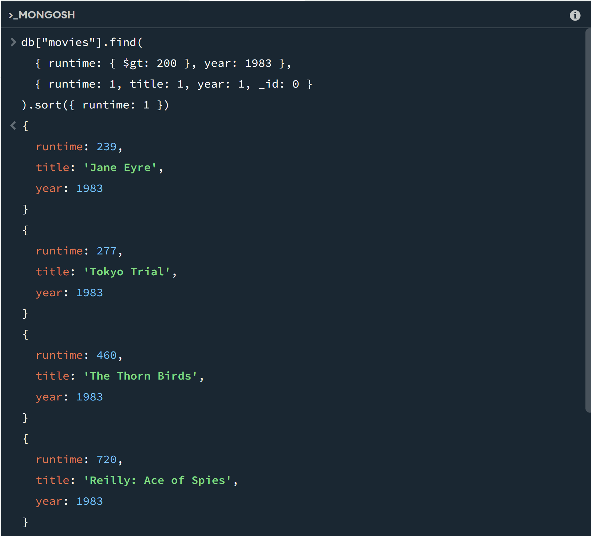
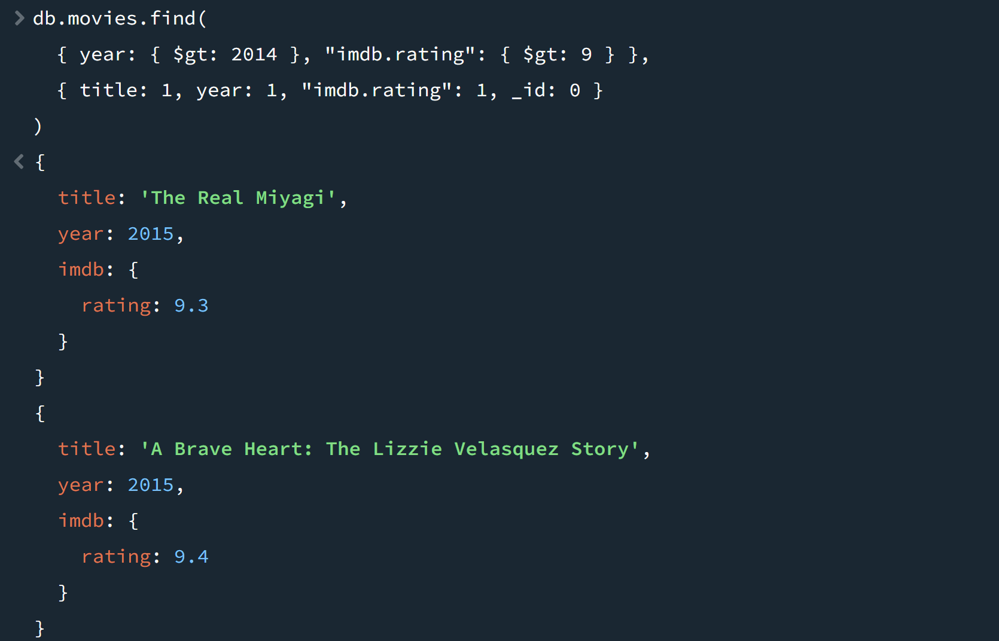

# CS3980-HW3: MongoDB Atlas Assignment

## Overview
This assignment covers setting up MongoDB Atlas, installing MongoDB Compass, 
and running queries on the sample_mflix dataset.

---

## Setup Steps

- Signed up for MongoDB Atlas and created a free M0 cluster
- Added a database user with read/write permissions
- Configured network access to allow connections
- Loaded the sample dataset (sample_mflix)
- Installed MongoDB Compass and connected using the Atlas connection string

---

## Query 1: Movies with Runtime > 200 Minutes in 1983

**Description:** Find all movies with a runtime greater than 200 minutes 
in the year 1983, sorted by runtime in ascending order. 
Only return the runtime, title, and year fields.

**Query:**
```js
db.movies.find(
  { runtime: { $gt: 200 }, year: 1983 },
  { runtime: 1, title: 1, year: 1, _id: 0 }
).sort({ runtime: 1 })
```

**Result:**



---

## Query 2: Movies After 2014 with IMDB Rating > 9

**Description:** Find all movies released after the year 2014 with an 
IMDB rating greater than 9. Only return the title, year, and IMDB rating.

**Query:**
```js
db.movies.find(
  { year: { $gt: 2014 }, "imdb.rating": { $gt: 9 } },
  { title: 1, year: 1, "imdb.rating": 1, _id: 0 }
)
```

**Result:**


